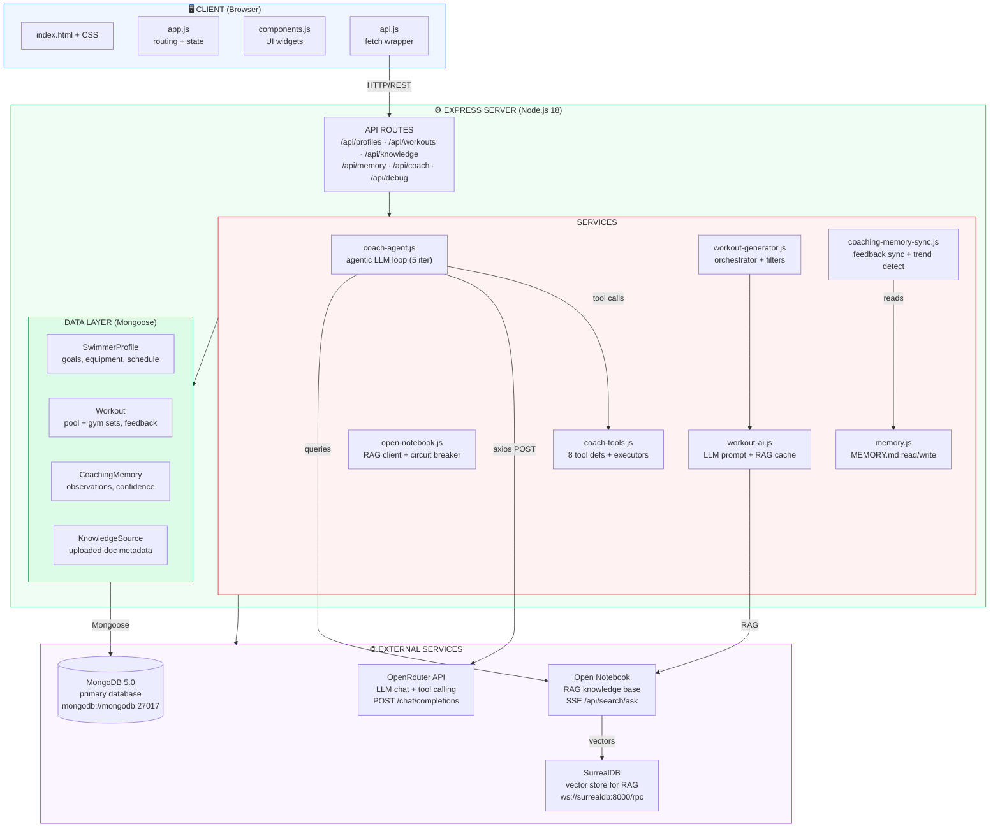
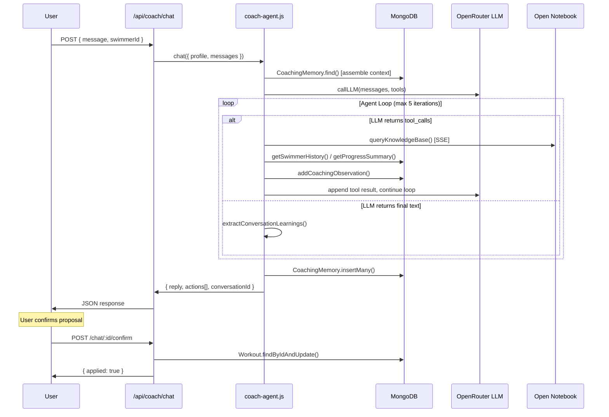
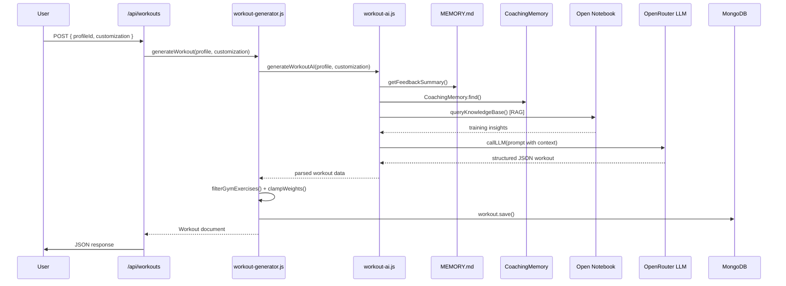
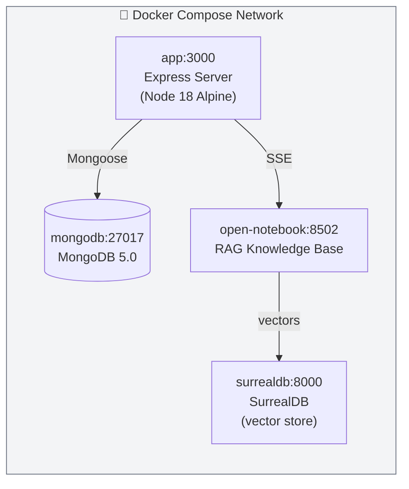

# SwimCoach System Architecture

## Coach Chat Request Flow

## Workout Generation Flow

## Deployment (Docker Compose)

## Tech Stack

| Layer | Technology |
| --- | --- |
| Runtime | Node.js 18 (Alpine) |
| Server | Express 4.x |
| Database | MongoDB 5.0 (via Mongoose ODM) |
| Vector DB | SurrealDB 2.x (for Open Notebook) |
| LLM (chat) | OpenRouter (tool-calling models) |
| LLM (RAG) | Open Notebook (knowledge base with uploaded docs) |
| Frontend | Vanilla JS (no framework), served as static files |
| Build | Webpack (bundle), Babel (transpile) |
| Testing | Jest |
| Deployment | Docker Compose (4 containers) |

## Key Design Decisions

1. **Agentic coach with tool calling** — The coach uses an iterative agent loop (up to 5 LLM calls per user message) with OpenAI-format function calling. Tools let it query knowledge, fetch history, and propose workout modifications.

2. **Proposal pattern for mutations** — Coach-proposed workout changes (modify/regenerate) are stored in an in-memory Map with a `conversationId`. The user must explicitly confirm via a separate API call before mutations apply. This prevents the LLM from making uncommitted writes.

3. **Dual memory systems** — Feedback loop uses both `MEMORY.md` (file-based, human-readable) and `CoachingMemory` (MongoDB, structured queryable observations). The sync service bridges them.

4. **RAG-backed workout generation** — Workout generation queries a scientific swimming knowledge base (Open Notebook over SurrealDB vectors) before sending context to the LLM, grounding workouts in training science.

5. **Equipment-aware generation** — Gym exercises are filtered against the user's available equipment, and prescribed weights are clamped to their actual inventory.
